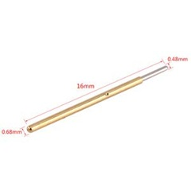
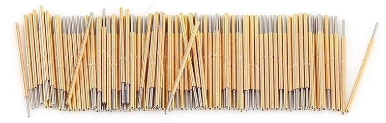

# JTAG_Needle
# !!!WORK IN PROGRESS!!!
Needle connectors for flashing/debugging hardware via JTAG become more and more popular last years.
But not as much the needle connectors themsleves as the corresponding "zero connector" footprint.
The footprint used as a flashing/debugging connector is beloved by managers as it looks like some cost optimizing move, but also by engineers as you can have one component implemented in layout itself and it is tech fun. 
So many people like them, I use them too. What nobody likes, though, is the price of needle adapters. It is a bit reduced through the last few years and you can find it on Digikey or Mouser for about 40-50$ or so but it is still a lot. For companies it may be not much, still developers tend to lose small things and bring them home so from my observations there are never enough of those adapters. And when individuals bring that footprint to their own projects - the price becomes unreachable, often beating the total price of designed target device.

I heard from nearly anyone facing that problem (using those connectors) that someone has to design an open source needle adapter to make it affordable for vast majority of makers. I waited for a few years but that didn't appear (or I didn't see it at least). So, having a few spare hours I decided to try to solve that problem.

This repo contains my attempt to make a low-cost open source needle adapter for JTAG.

## Spring needle probes
The probes for prototyping were "P50" series probes, sourced on Amazon, where they are sold in 100 pcs packs for about 5...8€, so less than 1$ per 10-pin adapter.
Suppliers as Digikey or Mouser have suitable options as well with some higher prices.
My choice was the probes with round shaped contact surface (P50-J1) as I was afraid sharp ends (like P50-B1) might damage the corresponding contact pads with extensive use.

The information available from web listings and some unnamed pdf files state the next:
- Current Rating: 3A
- Spring Pressure: 75g
- Current Resistance: 50mΩ
- Plunger: Heat Treated Beryllium Copper
- Barrel: Phosphor Bronze. Gold Plated
- Spring: Music Wire. Gold Plated

Recommended hole size for P50-J1 is 0.9 mm.
