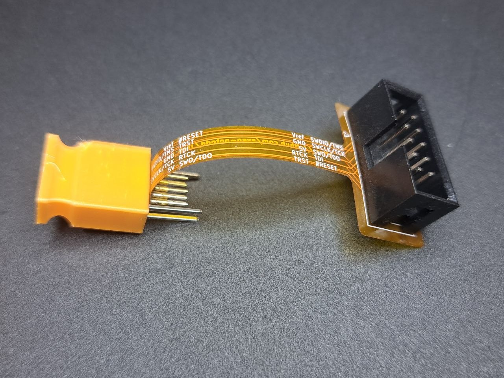
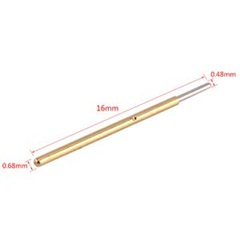
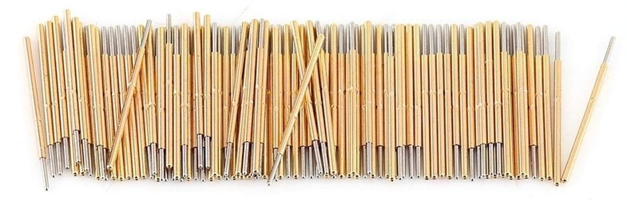
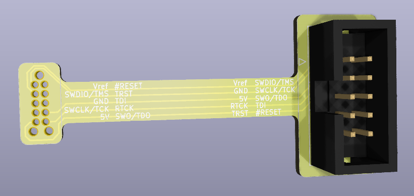
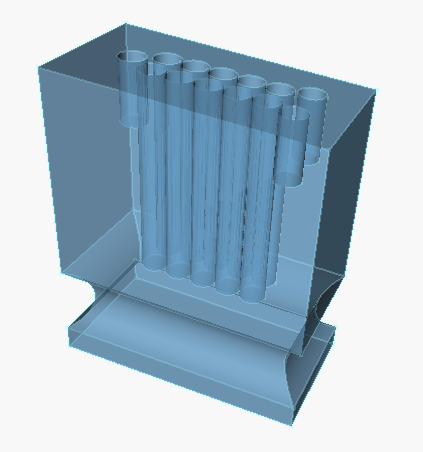
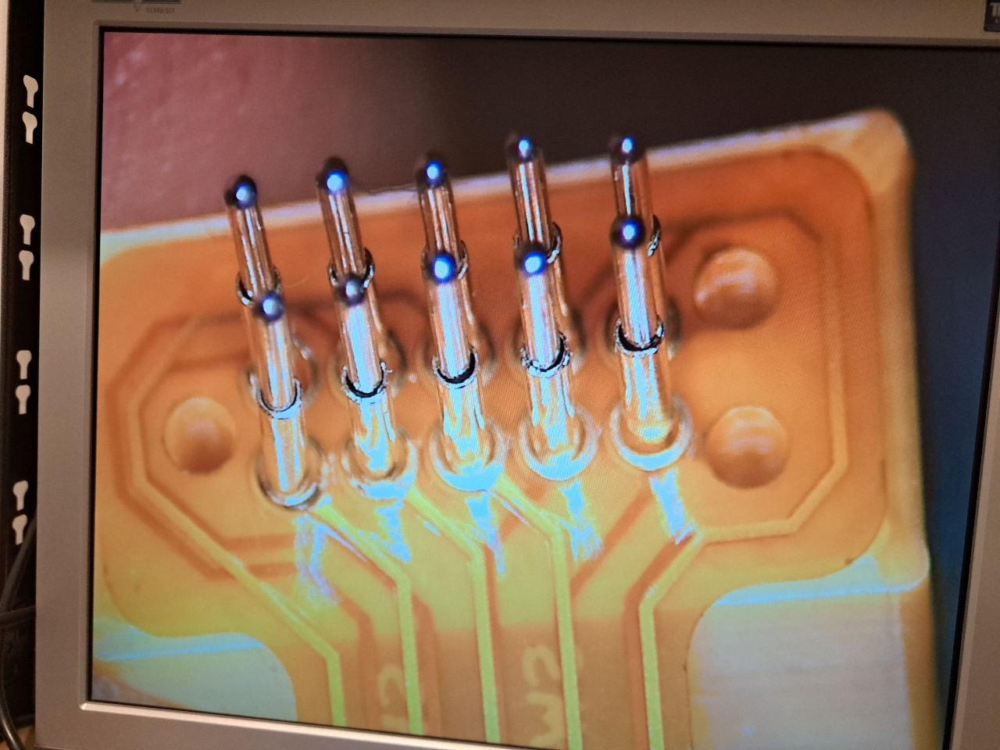
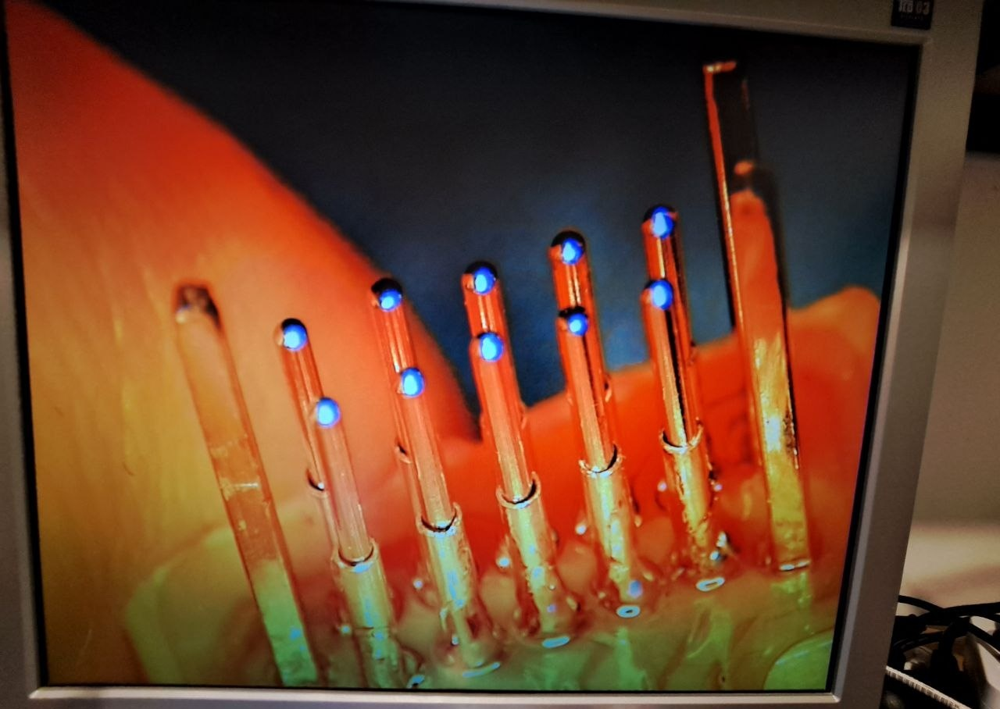

# JTAG_Needle

Needle connectors for flashing/debugging hardware via JTAG become more and more popular last years.
Maybe not as much the needle connectors themsleves as the corresponding "zero connector" footprint.
The footprint used as a flashing/debugging connector is beloved by many engineers as you can have one component implemented in layout itself and it is tech fun and looks like some cost optimizing move. 
So, many people like them, I use them too. What nobody likes, though, is the price of ready-to-use needle adapters. The price for 6/10 pin adapters is a bit reduced through the last few years and you can find it on Digikey or Mouser for about 40-50$ or so but it is still a lot. For companies it may be not much, still developers tend to lose small things and bring them home so from my observations there are never "plenty of adapters". And when individuals bring that footprint to their own projects - the price becomes unreachable, often beating the total price of designed target device. 

What is even worse - we cannot really modify it. If you want to rearange pins in that connector, say have 9 pins in 3x3 matrix - you will not find a needle connector for that.

I heard from nearly anyone facing that problem (using those connectors) that someone has to design an open source needle adapter to make it affordable for vast majority of makers. I waited for a few years but that didn't appear (or I didn't see it at least). So, having a few spare hours I decided to try to solve that problem.

This repo contains my attempt to make a low-cost open source 10-pin needle adapter for JTAG. 
Initial concept is to have a flexible PCB with a standard 10 pin header connecotr on one side and soldered needle probes on another side. The needle side may be later housed into some 3d printed shell for better mechanical fitting.

## Step 1: Spring needle probes
The probes for prototyping were "P50" series probes.
Suppliers as Digikey or Mouser have suitable options as well with some higher prices.
My choice was the probes with round shaped contact surface (P50-J1) as I was afraid sharp ends (like P50-B1) might damage the corresponding contact pads with extensive use.

The information available from web listings and some unnamed pdf files state the next:
- Current Rating: 3A
- Spring Pressure: 75g
- Current Resistance: 50mΩ
- Plunger: Heat Treated Beryllium Copper
- Barrel: Phosphor Bronze. Gold Plated
- Spring: Music Wire. Gold Plated

Recommended hole size for P50-J1 is 0.9 mm.

## Step 2: Flexible PCB
As long as we try to design it low-cost, 2 layers PCB will be just fine for the "Proof of Concept" version.
For the same reason flexible boards were ordered without stifeners (stiffeners were initially planned so the cable would take mechanical load from connectors). Depending on further 3D-printed parts design, the stiffeners may (or may not) come back in later itterations.

## Step 3: 3D printed part
The plastic part of the connector was designed in Freecad. The source file can be found in the repo along with exported STL. I used PETG but I guess any plastic will work the same here.

## Step 4: Assembly
Needle probes are inserted inside the plastic body "through" the flexible PCB. 

The PCB sits there quite tight and strictly speaking I expected there will be contact good enough even without soldering.
But of course I soldered.

The directing pins were extracted from some header connector and glued into the holes with 5 min epoxy. 

## Step 5: Cost
- Needble probes - 8€ for 100 pcs with delivery (Amazon).
- Flexible PCBs - 9.4€ for 5 pcs with delivery & customs (JLCPCB).
- IDC10 PCB connector - 15 cents/pc.
Header pins, a drop of epoxy and 0.5m of filament - I had in stock, but let's count it as maybe 10-20 cents.

So materials cost was about 3€ per adapter. 

And yeah, I know the time costs more. But:

A) Building things is fun. Even when nobody pays for that.

B) Now I don't need to think where my adapater is and how to order a spare one.

C) It clears a way to wider usage of spring probes for custom testing/debugging connectors.

## Step 6: ToDo
### This project is still work in progress, needs some testing and improvements!
By the time of this commit: mechanical fitness to corresponding footprint was checked, electrically not tested yet.
Also holders should be added to 3D printed part for comfortable connection while debugging.
Boards with stiffeners may stand loner use.

## License
See the  for details. 
